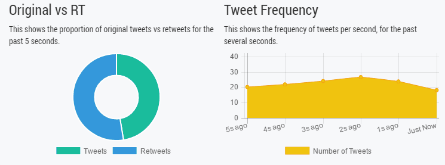

# Twitter Stream

Twitter Stream is a HTML5/VueJS visualization of a Twitter Sample Stream. The stream is captured by a simple .NET Core console application and uses [emitter.io](https://emitter.io) publish/subscribe api to make client talk to the server, check out [emitter on GitHub](https://github.com/emitter-io/emitter).

